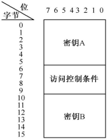

# MifareS50ByGolang

使用golang编程模拟Mifare S50

## 原理

Mifare S50，简称S50卡，应用非常广泛。工作距离小于100 mm，数据传输率为106 kb/s，完成一次读卡时间可小于0.1 s，工作频率为13.56
MHz。其特点：具有可靠性高、防碰撞能力强、一卡多用、安全性能好。这些特点可以从电子标签的存储结构上体现出来

Mifare S50卡有8 Kbit EEPROM,分成16个区，每个区分成4个分组（Block0～Block3），每个分组有16 字节。

1. 每个扇区由4块（块0、块1、块2、块3）组成（也有的将16个区的64个块按绝对地址编号为0～63。
2. 第0扇区的块0（即绝对地址0块）都是一个特殊的块，该块存储了制造商代码，已经固化，不可更改。
3. 每个扇区的块0、块1、块2为数据块，用于存储数据，可以进行读写操作。
4. 每个区的块3为控制块，包括了密钥A、访问控制条件、密钥B。密钥A有6字节，访问控制条件有4字节，密钥B有6字节。

控制权限的二进制位

| 控制位 | B6       | B7       | B8       |
|-----|----------|----------|----------|
| 000 | 00010001 | 00000001 | 00000000 |
| 010 | 00000001 | 00000001 | 00000001 |
| 100 | 00010000 | 00010001 | 00000000 |
| 110 | 00000000 | 00010001 | 00000001 |
| 001 | 00010001 | 00000000 | 00010000 |
| 011 | 00000001 | 00000000 | 00010001 |
| 101 | 00010000 | 00010000 | 00010001 |
| 111 | 00000000 | 00010000 | 00010001 |

## 文件结构
> * src/
>   * main.go 测试文件
>   * Tag.go RFID类及其方法
>   * utils.go 工具文件